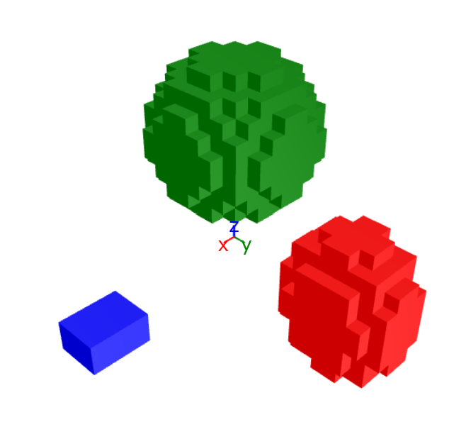

# VoxelModel.jl

[](https://github.com/akjake616/VoxelModel.jl/actions/workflows/CI.yml)

`VoxelModel.jl` is a Julia module for creating, manipulating, and visualizing 3D voxel geometries. It provides functionalities to create geometric shapes, add or delete them from a voxel grid, and visualize the grid using [`PlotlyJS.jl`](https://github.com/JuliaPlots/PlotlyJS.jl) and [`PlotlyGeometries,jl`](https://github.com/akjake616/PlotlyGeometries.jl). This project is dedicated to (hopefully) easy model creation in FDTD/PSTD simulations.

<p align="center">
  
</p>

## Installation

To install `VoxelModel.jl`, use the following command in the Julia REPL:

```julia
using Pkg
Pkg.add("VoxelModel")
```

## Learn by Examples

Please go to the examples folder for quick understanding of how to use the module:


- `ex_basics.jl`: This example code illustrates the basic functionalities of the module. 

- `ex_rotation.jl`: See how rotation works.

- `ex_advanced.jl`: Create more complicated geometries. This example demonstrates the creation of a sphere hollowd by cylinders.


## Usage

Please refer to the [user manual](./docs/MANUAL.md) in the docs folder.


